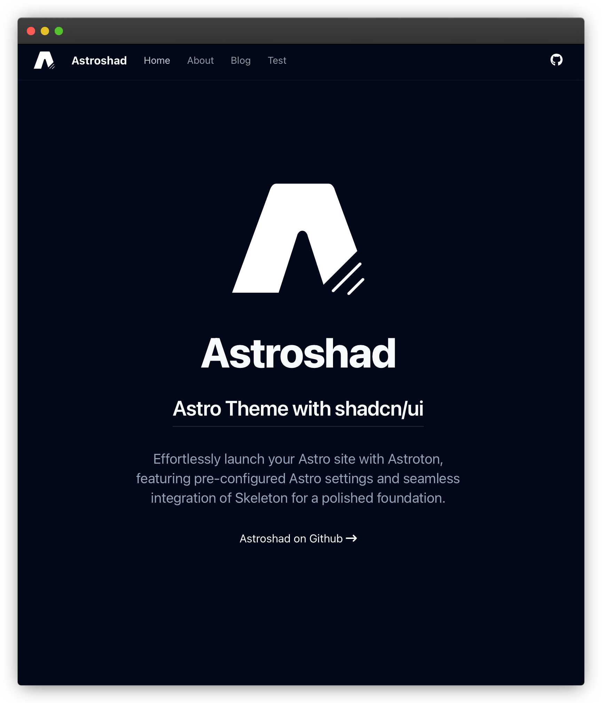

# Astroshad: Minimal Astro + ui.Shadcn Starter

**Astroshad** combines Astro + Tailwind + ui.shadcn. Quickstart your new Astro site with ui.shadcn. Astroshad is theme with the basic settings for Astro + ui.shadcn already setup for you.

This theme is not production ready (yet), instead can be seen as a starting point for Astro + ui.shadcn

## Repository state
  🟢 Active

Repository was created as a starting point for my own projects where i'm trying out shadcn and im in need of a starting point with [ui.shadcn](https://ui.shadcn.com/). There are more updates to be done until it can be set as a more complete theme but it is ready as a starting point.

## Contributing

Contribution is welcome, feel free to open an issue and fork. Waiting for your pull request.

## What's added so far
* Astro 4.3
  * Sitemap **Add-on**
  * ViewTransitions
  * Astro SEO
* React 18.2.0
  * **UI Shadcn 
* Tailwind
* Simple Blog

## Commands

| Command                   | Action                                           |
| :------------------------ | :----------------------------------------------- |
| `npm install`             | Installs dependencies                            |
| `npm run dev`             | Starts local dev server at `localhost:4321`      |
| `npm run build`           | Build your production site to `./dist/`          |

## License

**Astroshad** is licensed under the MIT license — see the [LICENSE](./LICENSE.md) file for details.